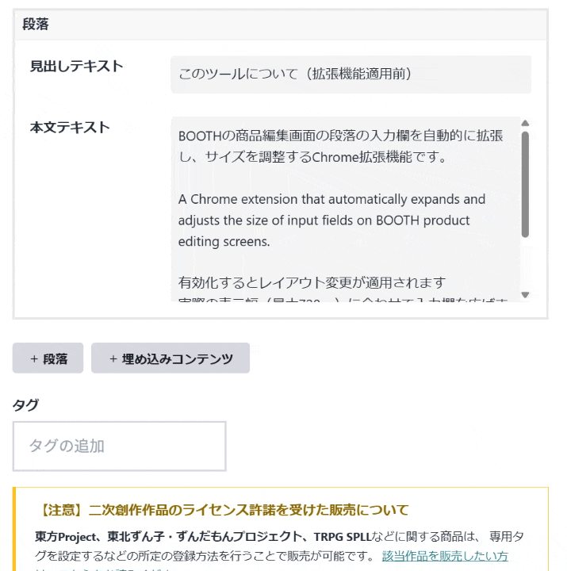
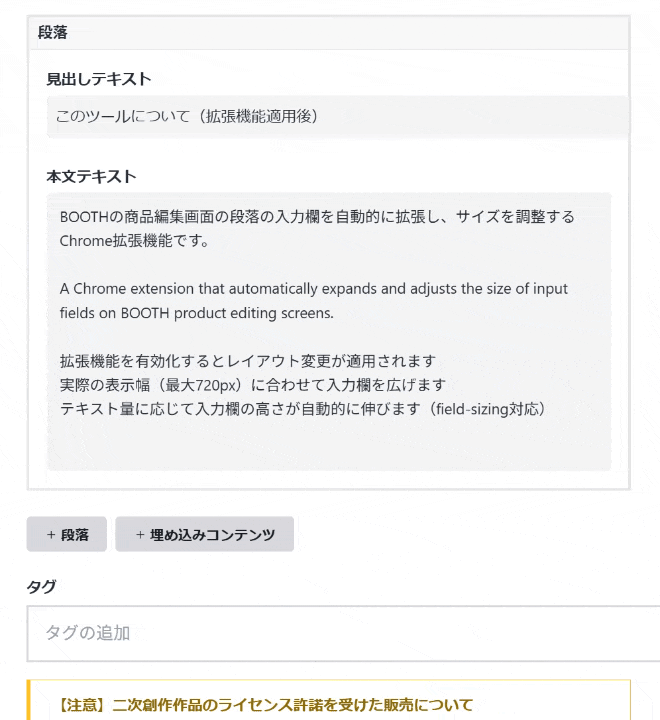
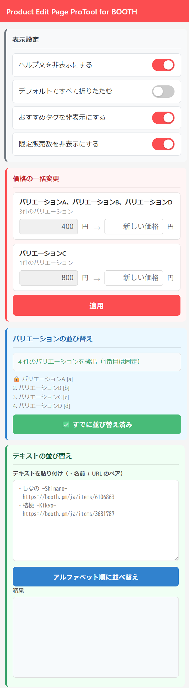

# Booth Product Edit Page ProTool

BOOTHの商品編集画面をより快適にするChrome拡張機能です。
入力欄の自動拡張、ヘルプテキストの非表示切り替え、セクションの折りたたみ、バリエーション価格の一括変更、バリエーションの自動並び替えなど、編集作業を効率化する機能をまとめて提供します。

## 入力欄の自動拡張

BOOTHの商品編集画面における「商品説明」等の入力欄幅を商品ページ相当に拡張し、縦方向も文字数に応じて自動的に拡張します。

| 適用前 | 適用後 |
|:---:|:---:|
|  |  |

## 主な機能

- **入力欄の自動拡張**: 実際の表示幅（最大720px）に合わせて入力欄を広げます
- **自動高さ調整**: テキスト量に応じて入力欄の高さが自動的に伸びます（field-sizing対応）
- **文字数表示との同期**: 実際のBOOTH商品ページの表示幅に合わせているため、改行位置の確認が容易です
- **バリエーション価格一括変更**: ポップアップUIから同じ価格のバリエーションをグループ化し、一括で価格を変更可能
- **バリエーション並び替え**: バリエーション名のアルファベット部分を抽出し、アルファベット順に自動並び替え（1番目は固定）。Chrome DevTools Protocol経由のドラッグ操作で確実に実行
- **テキスト並び替え**: 「・名前 + URL」形式のテキストをアルファベット順にソート可能。コピー・クリア機能付き、入力内容はstorageに自動保存
- **ヘルプテキスト非表示トグル**: 編集画面内のヘルプ文・注意書きをまとめて非表示/表示切り替え可能
- **おすすめタグ非表示トグル**: おすすめタグ（履歴・カテゴリ等）のセクションを非表示/表示切り替え可能
- **限定販売数非表示トグル**: 限定販売数の入力欄と説明文を非表示/表示切り替え可能
- **セクション折りたたみ**: 商品画像・商品紹介文・タグ・段落・ダウンロード商品の各セクションを折りたたみ/展開可能（折りたたみ時、段落・ダウンロード商品は先頭入力欄の内容を表示）
- **デフォルト折りたたみ**: ONにするとページを開いた時点ですべてのセクションが折りたたまれた状態で表示
- **段落テンプレート**: 段落の見出しテキスト・本文テキストをテンプレートとして保存し、ポップアップUIからワンクリックでページに追加可能。ページ上の段落にも保存ボタンを配置。複数テンプレートの保存・並び替え・削除に対応
- **バリエーションテンプレート**: ダウンロード商品のバリエーション名をテンプレートとして保存し、ポップアップUIから価格を指定してワンクリックで追加可能。追加時にファイル名を自動マッチングし、該当ファイルを自動選択（PSD・texture・material・バリエーション名の日本語/英語表記で検索）。ページ上のダウンロード商品にも保存ボタンを配置

## インストール方法

1. **Chrome拡張機能ページを開く**
   - Chromeで `chrome://extensions/` にアクセス
   - または、メニュー → その他のツール → 拡張機能

2. **開発者モードを有効化**
   - 右上の「開発者モード」をONにする

3. **拡張機能を読み込む**
   - 「パッケージ化されていない拡張機能を読み込む」をクリック
   - ダウンロードしたフォルダを選択

## ポップアップUI

拡張機能アイコンをクリックすると、以下の4つの機能カードに分かれたポップアップUIが表示されます。



| カード | 色 | 機能 |
|---|---|---|
| **表示設定** | グレー | ヘルプ文・折りたたみ・おすすめタグ・限定販売数の表示/非表示トグル |
| **価格の一括変更** | 赤 | 同じ価格のバリエーションをグループ化し、一括で価格を変更 |
| **バリエーションテンプレート** | オレンジ | バリエーション名のテンプレート保存・管理・ページへの追加（ファイル自動選択付き） |
| **段落テンプレート** | 紫 | 段落（見出し＋本文）のテンプレート保存・管理・ページへの追加 |
| **バリエーションの並び替え** | 青 | バリエーションをアルファベット順に自動並び替え（1番目は固定） |
| **テキストの並び替え** | 緑 | 「・名前 + URL」形式のテキストをアルファベット順にソート |

## 使い方

1. 拡張機能をインストールして有効化する
2. BOOTHの商品編集画面（`https://manage.booth.pm/items/*/edit`）を開く
3. 自動的に入力欄が広がり、快適に編集できます
4. 拡張機能アイコンをクリックすると、各種トグル・価格一括変更・バリエーション並び替え・テキスト並び替えのポップアップUIが表示されます

## 技術仕様

### 対応ブラウザ
- Google Chrome（Manifest V3対応）
- Microsoft Edge（Chromium版）
- その他Chromiumベースのブラウザ

### ファイル構成
```
Product-Edit-Page-ProTool-for-BOOTH/
├── manifest.json       # 拡張機能のマニフェストファイル
├── background.js       # Service Worker（CDP経由のドラッグ操作）
├── content.js          # 自動調整・並び替えロジック（設定値はここに記載）
├── styles.css          # スタイルシート
├── popup.html          # ポップアップUI
├── popup.js            # ポップアップロジック
├── popup.css           # ポップアップスタイル
├── docs/
│   └── popup-screenshot.png  # ポップアップUIのスクリーンショット
└── icons/
    ├── icon16.png      # アイコン（16x16）
    ├── icon48.png      # アイコン（48x48）
    └── icon128.png     # アイコン（128x128）
```


## 注意事項

- この拡張機能はBOOTHの公式ツールではありません
- BOOTHのUI更新により動作しなくなる可能性があります
- バリエーション並び替え機能はChromeデバッガを使用するため、実行中に「デバッグを開始しました」という警告バーが表示されます。並び替え完了後に自動で解除されます
- 並び替え実行中はポップアップウィンドウを閉じないでください

## 謝辞

BOOTHの素晴らしいプラットフォームを提供してくださっているpixiv Inc.に感謝します。

本ツールの開発にあたり、以下のコードを参考にさせていただきました。素晴らしい知見を公開してくださった nekobako 様に感謝いたします。
- [nekobako/content.js (Gist)](https://gist.github.com/nekobako/81cc427b7c80fe072ca82907b9da026f)

## ライセンス

MIT License

## 免責事項

- 非公式ツールであること 本拡張機能は、個人の開発者によって作成された非公式のソフトウェアです。pixiv Inc. および BOOTH 公式とは一切関係ありません。本拡張機能に関するお問い合わせを BOOTH 事務局へ送ることはお控えください。

- 保証の否認 本拡張機能は「現状有姿（as is）」で提供されます。開発者は、本拡張機能の動作、特定の目的への適合性、および不具合がないことを保証しません。また、BOOTH の仕様変更により、予告なく本拡張機能が動作しなくなる可能性があります。

- 責任の制限 本拡張機能の使用によって生じた、いかなる直接的・間接的な損害（商品説明文の消失、レイアウト崩れ、機会損失、アカウントへの影響などを含むがこれに限らない）について、開発者は一切の責任を負いません。ご利用は利用者ご自身の責任において行ってください。

- 権利の帰属 「BOOTH」は、ピクシブ株式会社の商標または登録商標です。

- BOOTHの仕様変更・改善について 本ツールは、BOOTH公式によるサイト改善や仕様変更を妨げるものではありません。BOOTH側のアップデートにより本ツールの機能が正常に動作しなくなった場合、BOOTH公式へのお問い合わせは絶対に行わないでください。本ツールの動作修正は、開発者の対応可能な範囲で行われます。

## 更新履歴

### v1.3.0 (2026-04-13)

- **段落テンプレート機能を追加**: 段落の見出しテキスト・本文テキストをテンプレートとして保存し、ポップアップUIからワンクリックでページに追加可能
  - ページ上の各段落ヘッダーに「💾 保存」ボタンを配置し、現在の内容をそのままテンプレートとして保存
  - ポップアップUI上で手動入力による新規テンプレート作成にも対応
  - テンプレート一覧は折りたたみ式で、見出しテキストのみの表示から展開して本文を確認可能
  - テンプレートの並び替え（▲▼）・削除に対応
- **バリエーションテンプレート機能を追加**: ダウンロード商品のバリエーション名をテンプレートとして保存し、ポップアップUIから価格を指定してワンクリックで追加可能
  - ページ上の各ダウンロード商品ヘッダーに「💾 保存」ボタンを配置
  - 追加時に販売方法選択ダイアログで「ダウンロード販売」を自動選択
  - ファイル名の自動マッチングによるファイル自動選択（PSD・texture・material・バリエーション名の日本語/英語表記で検索）
  - テンプレートの並び替え（▲▼）・削除に対応
- **タグセクションの折りたたみを追加**: タグ入力欄・おすすめタグ・注意文をまとめて折りたたみ/展開可能
- **ポップアップUIに2つの新カードを追加**: 「バリエーションテンプレート」（オレンジ）「段落テンプレート」（紫）
- **テキスト並び替えセクションの改善**: 入力側にクリアボタンを追加、前回の入力内容の自動保存を廃止

### v1.2.0 (2026-04-12)

- **バリエーション並び替え機能を追加**（BOOTH Variation Sorter の機能を統合）: ポップアップUIのボタンからバリエーションをアルファベット順に自動並び替え。1番目のバリエーションは固定。バリエーション名からアルファベット部分を抽出してソートキーとして使用（例: 「しなの -Shinano-」→ `shinano`）。Chrome DevTools Protocol経由のドラッグ操作で実行。キャンセル機能あり
- **テキスト並び替え機能を追加**: ポップアップUI上で「・名前 + URL」形式のテキストをアルファベット順にソート。コピー・クリア機能付き、入力内容はstorageに自動保存
  - ショップ名（「・」で始まらない行）を自動検出し、ソート結果の末尾にまとめて一覧表示
  - BOOTH URLの自動正規化（例: `https://xxx.booth.pm/items/1234` → `https://booth.pm/ja/items/1234`）
  - URL行の先頭に全角スペースがない場合は自動付与
- **ポップアップUIを機能別カードに整理**: 「表示設定」（グレー）「価格の一括変更」（赤）「バリエーションの並び替え」（青）「テキストの並び替え」（緑）の4つのカードに色分けし、機能の区切りを明確化
- **background.js（Service Worker）を追加**: バリエーション並び替えのためのCDPデバッガ管理・マウスドラッグシミュレーションを担当
- **permissions追加**: `scripting`, `debugger`, `storage` を追加

### v1.1.0 (2026-04-12)

- **名称変更**: 「Product Edit Page Extension for BOOTH」→「Booth Product Edit Page ProTool」
- **バリエーション価格一括変更機能を追加**: ポップアップUIから同じ価格のバリエーションをグループ化し、一括で価格を変更可能（Booth Price Changer の機能を統合）
- **ヘルプテキスト非表示トグルを追加**: ページ右下のボタンまたはポップアップのスイッチで、編集画面内のヘルプ文・注意書きをまとめて非表示/表示切り替え可能。対象テキスト:
  - 「1番目の画像が商品一覧のサムネイル...」
  - 「スペック（サイズ・素材・色・ページ数…）...」
  - 「埋め込みコンテンツ」の説明
  - 「商品の公開後、一部の決済手段については...」
  - 「【注意】二次創作作品のライセンス許諾...」
  - 「即売会などのイベントで頒布した...」
  - 「海外への販売のため...」
  - 「タグは、検索キーワードとしてだけでなく...」
- **おすすめタグ非表示トグルを追加**: ページ右下のボタンまたはポップアップのスイッチで、おすすめタグ（履歴・カテゴリ等）セクションを非表示/表示切り替え可能
- **限定販売数非表示トグルを追加**: ページ右下のボタンまたはポップアップのスイッチで、限定販売数の入力欄・説明文を非表示/表示切り替え可能
- **セクション折りたたみ機能を追加**: 各セクションのラベル横に▼ボタンを配置し、折りたたみ/展開が可能（ページ遷移時にリセット）
  - 商品画像: 折りたたむと画像エリアが1行分のみ表示
  - 商品紹介文: 折りたたむとテキストエリアが数行のみ表示
  - タグ: 折りたたむとタグ入力欄・おすすめタグ・注意文が非表示
  - 段落: 折りたたむと本体コンテンツが非表示になり、▶の横に見出しテキストの内容を表示
  - ダウンロード商品: 折りたたむと本体コンテンツが非表示になり、▶の横にバリエーション名を表示
- **デフォルト折りたたみトグルを追加**: ONにするとページを開いた時点ですべてのセクションが折りたたまれた状態で表示
- **ポップアップUIを追加**: 拡張機能アイコンクリックで統合UIを表示（各種トグル + 価格一括変更）

### v1.0.0

- 初回リリース
- 入力欄の自動拡張（最大720px）
- テキストエリアの自動高さ調整（field-sizing対応）
- 段落セクションの縦積みレイアウト変更
